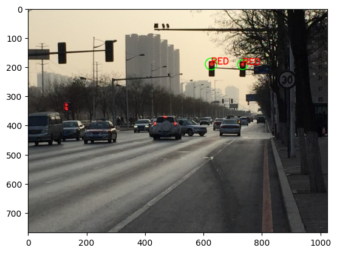

# 🚦 Traffic Light Color Detection

This project implements a simple and lightweight traffic light color detection system using OpenCV. The algorithm uses HSV color space thresholding combined with Hough Circle Detection to identify the color of traffic lights in real-world images.

## 🧠 Main Features

- Real-time detection of RED, YELLOW, and GREEN lights
- HSV color segmentation
- Circle detection to locate light bulbs
- Robust against daylight and angle variations (to some extent)

## 📁 Project Structure
Traffic-Light-Color-Detection/
│
├── detect_traffic_light.py # Main detection script
├── input_output/ # Sample input and output images
├── README.md # Project documentation
└── requirements.txt # Python dependencies

## 🖼 Sample Output

Here are a few examples from the test images:

## ⚙️ Requirements

See [`requirements.txt`](requirements.txt) for dependencies.

## 📌 Usage

python detect_traffic_light.py

Make sure to place your test images inside the input_output/ directory or change the path in the code.

## 👨‍💻 Author

@Sara-GRB